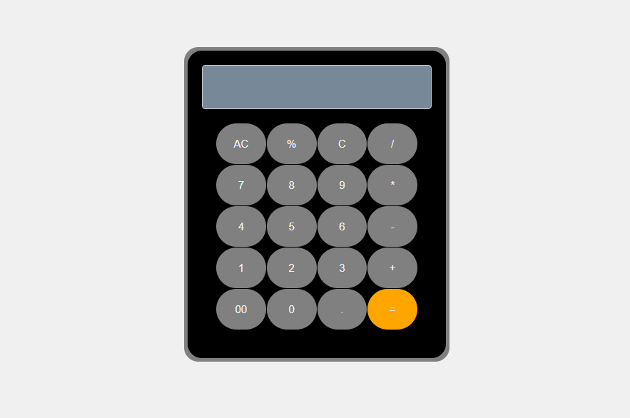

# Simple Calculator

This repository contains a simple calculator built using HTML, CSS, and JavaScript. This project is part of my learning journey.

## Screenshot

Here’s a screenshot of the calculator in action:

## Features

- Basic arithmetic operations (addition, subtraction, multiplication, division, modulus)
- Responsive design

## Learning Goals

- Understand the basics of HTML, CSS, and JavaScript
- Implement a simple user interface
- Learn to handle user input and perform calculations

## Feedback

I'm open to constructive feedback! Feel free to open an issue or submit a pull request if you have suggestions or improvements.

